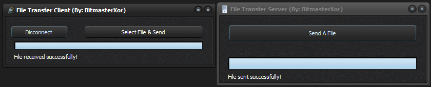

# Delphi Socket File Transfer

A simple yet robust file transfer application built with Delphi using the WinSock wrapper components TClientSocket and TServerSocket. This application enables bidirectional file transfers between client and server over TCP/IP connections.

## Features

- **Bidirectional File Transfer**: Send files from client to server or server to client
- **Progress Tracking**: Real-time progress bar displays transfer completion percentage
- **Chunked Transfer**: Files are sent in 8KB chunks for efficient memory usage
- **Drag-and-Drop Ready**: Easily integrated into any Delphi application
- **Automatic Reconnection**: Handles connection drops gracefully
- **File Overwrite Protection**: Prompts before overwriting existing files

## Architecture

The application consists of two main components:

### Server Component
- Built using TServerSocket component
- Listens on port 3434 by default
- Manages client connections
- Handles file reception and sending
- Includes progress tracking

### Client Component
- Built using TClientSocket component
- Connects to server using IP address and port
- Sends files to server
- Receives files from server
- Tracks progress with visual indicators

## Protocol

The application uses a simple text-based protocol for negotiation and binary transfer for file data:

1. **File Info Exchange**: `FileSize|FileName` or `SERVER_SENDING|FileSize|FileName`
2. **Transfer Acknowledgment**: `READY_TO_RECEIVE`
3. **Chunk Acknowledgment**: `CHUNK_RECEIVED`

Files are transferred in 8KB chunks with acknowledgments between each chunk to ensure reliable delivery.

## Getting Started

### Prerequisites
- Delphi IDE (tested with Delphi 10.4 and later)
- Windows OS

### Installation
1. Clone this repository
2. Open the project in Delphi IDE
3. Compile both client and server applications

### Usage

#### Server Application
1. Launch the server application
2. The server automatically starts listening on port 3434
3. Wait for a client connection
4. Use the "Send File" button to send a file to the connected client
5. When a client sends a file, the server will receive it automatically

#### Client Application
1. Launch the client application
2. Click "Connect" to connect to the server (default: localhost:3434)
3. Once connected, use "Send File" to send a file to the server
4. The client will automatically receive files sent from the server

## Configuration

You can modify the following constants in the code:

- **CHUNK_SIZE**: Adjust the chunk size (default: 8KB)
- **Port**: Change the server port in `FormCreate` method (default: 3434)
- **Host**: Change the server host in `Button1Click` method (default: localhost)

## Implementation Details

The file transfer is implemented using Delphi's stream classes and socket components:

- **TFileStream**: Handles file I/O operations
- **TServerSocket/TClientSocket**: Manages TCP/IP connections
- **SendBuf/ReceiveBuf**: Transfers raw binary data

## License

Free and Open Source for use with any project!

## Acknowledgements

- Delphi VCL components
- Windows Socket API

## Contributing

Contributions are welcome!

## Contact

Discord: bitmasterxor
